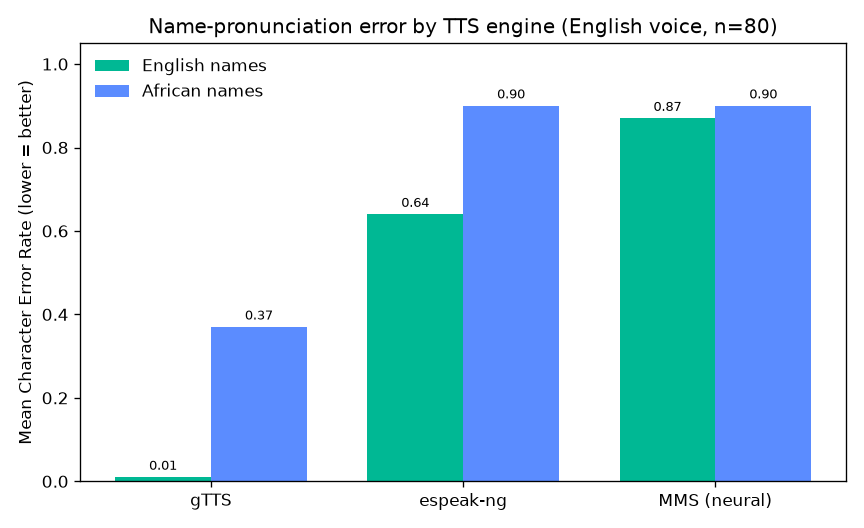
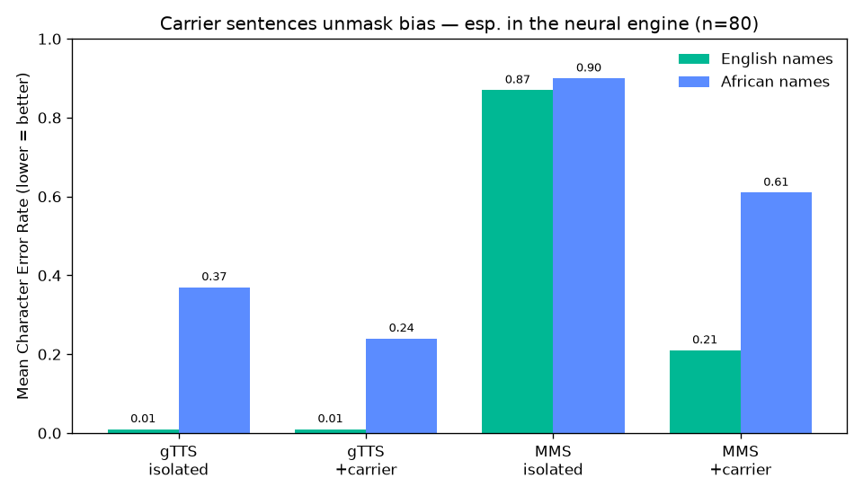
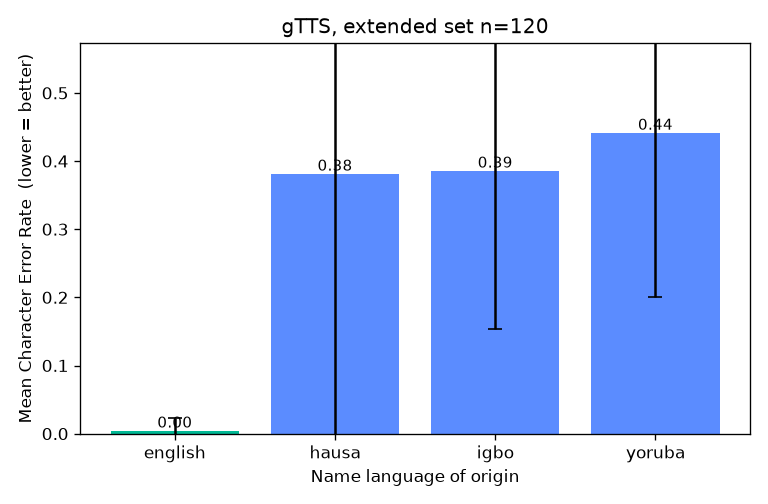

# Findings: how three open TTS systems handle African names

*A preliminary study from the [name-pronunciation fairness benchmark](README.md).*
*All numbers are from n=80 names (20 each: English, Yoruba, Igbo, Hausa),
scored by Whisper back-transcription. Preliminary — one ASR scorer, small n.*

## TL;DR

1. **The mainstream system is measurably biased.** Google's gTTS pronounces
   English names almost perfectly (CER 0.01) but African names far worse
   (0.37) — a gap that is **statistically significant and large**
   (Mann-Whitney p ≈ 9×10⁻⁹, Cliff's δ = +0.82).
2. **"Newer/neural" does not mean "fairer" — and naive benchmarking hides that.**
   Meta's neural MMS model scored *badly on everything*, including English
   (0.87), so its gap looks tiny (+0.04, not significant). That is a **metric
   artifact**, not fairness: MMS mumbles isolated names. Reading the small gap
   as "fair" would be wrong.
3. **Coverage gaps come before pronunciation.** Meta's "massively multilingual"
   MMS ships Yoruba and Hausa TTS voices but **no Igbo voice at all**
   (`facebook/mms-tts-ibo` does not exist). Some languages are excluded before
   quality is even a question.
4. **A fairer test unmasks hidden bias.** Evaluating names inside a **carrier
   sentence** ("My name is X.") removes the isolated-word saturation. The neural
   engine's fake "no gap" (§2) becomes a **large, significant gap** (English
   0.21 vs African 0.61, Cliff's δ = +0.70, p ≈ 1.5×10⁻⁶) — the bias was real
   all along, just hidden by the naive metric.



## Carrier-sentence result — the methodology matters

Speaking each name inside "My name is **X**." (instead of in isolation) lets
neural engines produce natural connected speech, fixing the saturation from §2.



| engine | condition | English CER | African CER | gap | significance |
|--------|-----------|------------:|------------:|----:|--------------|
| gTTS | isolated | 0.01 | 0.37 | +0.36 | δ=+0.82, p≈9e-9 |
| gTTS | +carrier | 0.01 | 0.24 | +0.24 | δ=+0.75, p≈1e-7 |
| MMS  | isolated | 0.87 | 0.90 | +0.04 | *not sig. (saturated)* |
| MMS  | +carrier | 0.21 | 0.61 | **+0.40** | **δ=+0.70, p≈1.5e-6** |

**Takeaways:**
- **The bias is robust**, not a scoring artifact: gTTS stays significantly biased
  even with the fairer carrier test (African error drops as context helps, but
  the gap persists).
- **The neural engine is biased too** — and only the carrier test could show it.
  Its isolated-word "no gap" was a measurement failure, not fairness. This is the
  clearest lesson of the study: *how you evaluate determines whether you can even
  see the bias.*

## Method

Each name is (1) synthesized with a TTS engine's **English** voice (so engines
are compared on equal footing), (2) transcribed back with Whisper (`base`), and
(3) scored by **Character Error Rate (CER)** between the intended name and the
transcription. Per-language means are compared with the non-parametric
**Mann-Whitney U** test and **Cliff's delta** effect size (see
[README](README.md#statistical-significance)).

**Why back-transcription:** if a TTS mispronounces a name, an English recognizer
cannot recover it. It needs no human ground truth. **Its limitation** (central to
these findings): it conflates *pronunciation quality* with *how ASR-friendly the
audio is*, so it is only interpretable when the engine has a clean English
baseline.

## Results (English voice, n=80)

| engine | English CER | African CER | gap | interpretable? |
|--------|------------:|------------:|----:|----------------|
| **gTTS** (Google) | **0.01** | 0.37 | **+0.36** | ✅ clean baseline → gap is real (p≈9e-9, δ=+0.82 large) |
| **espeak-ng** (formant) | 0.64 | 0.90 | +0.26 | ⚠️ robotic audio inflates the baseline |
| **MMS** (neural) | 0.87 | 0.90 | +0.04 | ❌ baseline saturated → gap uninformative |

Per language (mean CER): gTTS — Igbo 0.32, Yoruba 0.37, Hausa 0.42.

## What it actually sounds like (gTTS, isolated)

The numbers show *that* there's bias; these show *what it sounds like*. English
names come back essentially perfect; African names are turned into unrelated
English words. (Full table: [`docs/error_analysis_gtts.md`](docs/error_analysis_gtts.md),
generated by `error_analysis.py`.)

| name | language | heard by ASR as |
|------|----------|-----------------|
| Katherine | English | "Catherine" *(the worst English case — CER 0.11)* |
| Aliyu | Hausa | "I'll leave you." |
| Hauwa | Hausa | "How are you?" |
| Emeka | Igbo | "America" |
| Uchenna | Igbo | "channel" |
| Olumide | Yoruba | "All you might." |
| Oluwaseun | Yoruba | "Alois Seyoon" |
| Folake | Yoruba | "For Locker" |

The failure mode is consistent: rather than attempt the name, the English voice
(and recogniser) reach for the nearest English word.

## Replication on the extended set (gTTS, n=120)

Re-running gTTS on the larger 120-name set (`data/names_extended.csv`, 30 per
language) **replicates and strengthens** the headline result:

| language | mean CER | exact-match |
|----------|---------:|------------:|
| english  | 0.00 | 97% |
| hausa    | 0.38 | 33% |
| igbo     | 0.39 | 10% |
| yoruba   | 0.44 | 3%  |

English vs African: Cliff's **δ = +0.84 (large)**, **p ≈ 1×10⁻¹²** — a stronger
significance level than at n=80, with every per-language gap significant after
correction. The effect is not an artifact of the small sample.



**Carrier replication (n=120) holds too:** gTTS+carrier English 0.00 / African
0.25 (p≈1.9×10⁻¹¹); MMS+carrier English 0.20 / African 0.58 (p≈7×10⁻⁸) — the
neural engine's bias, unmasked by the carrier, replicates at the larger scale.
See [RESULTS.md](RESULTS.md) for all runs side by side.

## The methodological lesson (the real result)

**You cannot compare fairness across engines by comparing gap sizes.** An engine
whose audio the ASR can barely read (espeak, MMS) pushes *every* name toward the
error ceiling, shrinking the apparent gap. The gap is only meaningful relative to
each engine's own English baseline:

- gTTS: baseline 0.01 → the +0.36 gap is a genuine, large disparity.
- MMS: baseline 0.87 → a +0.04 gap says nothing about fairness, only that the
  metric is saturated.

A benchmark that ignored this would have proudly (and wrongly) reported "the
modern neural model is unbiased." Catching the confound is the point.

## Native-voice observation (qualitative)

MMS ships per-language voices (`mms-tts-yor`, `mms-tts-hau`; **no** `mms-tts-ibo`).
Informal listening suggests the native models render their own names far more
naturally than the English model does. But this axis **cannot** be scored with an
English ASR — the honest evaluation is **native-speaker judgement**, which is the
proper (and ethically correct) next step.

## Limitations

- One ASR scorer (Whisper `base`); ASR has its own biases folded into the metric.
- Small n (20/language); results are illustrative, not a population claim.
- Names are a general-knowledge list, **not** native-speaker validated (see
  README ethics). Spellings/diacritics need review.
- One English voice per engine; commercial systems (Polly, Azure, Google Cloud,
  ElevenLabs — the ones actually in assistants/screen readers) are untested.

## Reproduce

```bash
pip install -r requirements.txt        # includes gTTS, faster-whisper, matplotlib, scipy
# transformers + torch for the neural (MMS) engine; espeak-ng binary for espeak
for eng in gtts espeak mms; do
  python run.py   --engine $eng --out outputs_$eng
  python score.py --run outputs_$eng --model base
  python analyze.py --scores outputs_$eng/scores.csv --out outputs_$eng/analysis
done
```
