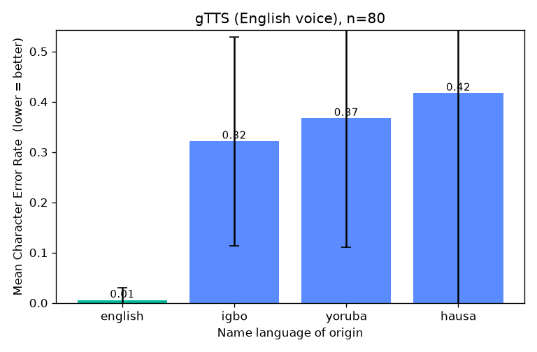

# AI Name-Pronunciation Fairness Benchmark

[](https://github.com/amhanesipeace/name-pronunciation-benchmark/actions/workflows/ci.yml)

Measuring how accurately text-to-speech (TTS) systems pronounce personal names
from African languages (**Yoruba, Igbo, Hausa**) compared to common **English**
names — to surface and quantify bias in deployed speech systems.

> **Status: v0.7 — three engines + write-up.** 80 names (20 per language). The
> pipeline synthesizes with a chosen TTS engine (gTTS, espeak-ng, or Meta's
> neural MMS), scores pronunciation via Whisper back-transcription, and
> aggregates into per-language stats, a chart, and significance tests.

📄 **[Paper-style writeup →](PAPER.md)** (abstract · method · results ·
limitations · ethics) · **[master results table →](RESULTS.md)** · detailed
**[findings →](FINDINGS.md)**: gTTS shows a large, significant bias against
African names; "neural" MMS is not fairer (its metric just saturates until a
carrier test unmasks it); and MMS ships **no Igbo voice at all**.

## Why this matters

Screen readers, voice assistants, and automated systems mispronouncing a
person's name is a real, repeated harm — it disproportionately affects people
with names outside the English/Western mainstream. A reproducible benchmark
turns "this feels biased" into measurable evidence.

## Project layout

```
name-pronunciation-benchmark/
  data/names.csv          studied dataset — 80 names (20/language); results use this
  data/names_extended.csv larger set — 120 names (30/language) for bigger runs
  data/SOURCES.md         dataset provenance, sourcing + validation notes
  ttsbench/
    dataset.py          load names from CSV  -> list[Name]
    engines.py          TTSEngine interface + GTTSEngine (add more here)
    synth.py            run names through an engine, write audio + manifest.csv
  run.py                CLI entry point
  outputs/              generated audio + manifest (git-ignored; see below)
  requirements.txt
```

## Quick start

```bash
python3 -m venv .venv && source .venv/bin/activate
pip install -r requirements.txt
python run.py                              # gTTS, English voice
python run.py --engine espeak --out outputs_espeak   # espeak-ng (needs the binary)
python run.py --engine mms --carrier --out outputs_mms_carrier   # carrier sentence
```

Outputs land in `outputs/audio/*` with `outputs/manifest.csv` describing every
file. Use a separate `--out` dir per engine to keep runs side by side.

**One-command pipeline** — a `Makefile` runs synthesize → score → analyze for
each engine so the whole study reproduces from scratch:

```bash
make setup PYTHON=.venv/bin/python          # install deps
make all   PYTHON=.venv/bin/python          # gTTS + carrier runs + error tables
make test  PYTHON=.venv/bin/python          # unit tests
# individual: make gtts | gtts-carrier | espeak | mms | mms-carrier | errors | clean
```

**Carrier sentences** (`--carrier`): speak each name inside a sentence
(`"My name is {name}."`) instead of in isolation. Neural engines (e.g. MMS) are
trained on connected speech and mangle lone words, which *saturates* the metric
and hides real differences; a carrier gives them natural speech to synthesize,
making cross-engine comparison fair. Scoring auto-detects the carrier (recorded
in the manifest) and isolates the name region before measuring error.

## Engines

| id | library / binary | key? | offline | reproducible | notes |
|----|------------------|------|---------|--------------|-------|
| `gtts`   | gTTS (pip)          | no | no  | weak   | real Google system; unofficial endpoint |
| `espeak` | espeak-ng (binary)  | no | yes | strong | deterministic; can emit IPA phonemes |
| `mms`    | transformers (pip)  | no | yes | strong | Meta MMS-TTS neural model; per-language voices (yor/hau; **no** ibo) |
| `elevenlabs` | ElevenLabs REST | **yes** | no | versioned | commercial neural TTS (a real product voice); set `ELEVENLABS_API_KEY` |

The `mms` engine pulls PyTorch (heavy). Install the espeak-ng binary separately
(it is not pip-installable):

```bash
brew install espeak-ng          # macOS (needs Homebrew)
# sudo apt-get install espeak-ng   # Debian/Ubuntu
```

## Design notes (the "why")

- **Engine abstraction.** `TTSEngine` is an abstract base class; `GTTSEngine`
  is the first implementation. Swapping in an offline/open engine or a
  commercial one later is a single new subclass — the pipeline is unchanged.
- **English voice on every name (for now).** v0.1 uses one English voice for
  *all* names. That is the core bias probe: how does an English-centric TTS —
  the kind embedded in most assistants — handle African names? Native-language
  voices are a separate axis to add later.
- **Everything is logged.** The manifest records engine + version + language +
  UTC timestamp + file path per name, so runs are auditable and comparable.

## ⚠️ Reproducibility considerations

- **gTTS is not stable over time.** It calls an *unofficial* Google Translate
  endpoint whose output can change silently. Treat generated audio as a
  **primary artifact to archive**, not something you can always regenerate
  identically. Always record the date and library version (the manifest does).
- **Archive audio outside git.** `outputs/` is git-ignored because raw audio is
  large and binary. For a paper, archive a fixed snapshot (zipped release, Git
  LFS, or a data repository like **Zenodo / OSF**) and cite it.
- **Pin versions** in `requirements.txt` when you freeze an experiment.
- **Prefer open, versioned models** (Coqui/Piper/espeak-ng) or **documented
  cloud APIs** (Google Cloud TTS, Amazon Polly, Azure) for results you intend
  to publish — they can be pinned to a model/voice version.

## ⚠️ Ethical considerations

- **Names are people.** Use common given names or documented name lists, and
  cite their source. Do **not** target or profile private individuals.
  **Provenance:** the names are common given names compiled from general
  knowledge (not a cited corpus) and are *not yet* validated by native speakers —
  see [`data/SOURCES.md`](data/SOURCES.md) for the full provenance, sourcing, and
  validation notes. Before any publication, replace/verify them with documented
  sources and native-speaker review of spellings and diacritics.
- **Ground truth needs native speakers.** Scoring "correct" pronunciation
  requires a reference (IPA and/or native-speaker recordings). Source this with
  the **informed consent and credit** of native speakers; treat it as human-
  subjects data and check whether your institution's **IRB/ethics board**
  applies.
- **Frame findings to reduce harm.** The goal is to expose and fix bias, not to
  caricature languages or communities. Involve native speakers in interpretation.
- **Respect terms of service.** Heavy automated use of unofficial endpoints
  (gTTS) may violate provider ToS; use official APIs for anything at scale.
- **Metric bias.** However you eventually score pronunciation (ASR
  back-transcription, phoneme distance vs IPA, human MOS ratings), the metric
  has its *own* biases — document and justify the choice.

## Scoring

```bash
pip install faster-whisper                 # one-time (heavier dependency)
python score.py --run outputs --model base # transcribe + score a synthesis run
```

Each clip is transcribed with Whisper and compared to the intended name via
**Character Error Rate (CER)**; results are written to `<run>/scores.csv` and
summarised per language.

## Phoneme scoring (ASR-independent) — experimental

```bash
pip install allosaurus av
python phoneme_score.py --run outputs --names data/names.csv   # isolated-name run
```

The CER metric depends on an English **word** recogniser. This layer instead
reads **phones directly from the audio** with a universal phoneme recogniser
([allosaurus](https://github.com/xinjli/allosaurus)) — no word-level ASR — and
measures a **Phoneme Error Rate (PER)** against a reference in the `ipa` column
(`ttsbench/phonemes.py`).

**Two honest limitations found while building it** (this is infrastructure, not
yet a headline result):

1. **No reference for the target languages.** espeak-ng has no Yoruba/Igbo/Hausa
   voices, so references can't be auto-generated. English references are provided
   (espeak-en G2P); African-name references require **native-speaker validation**
   before PER is meaningful — the tool consumes them the moment they exist.
2. **The universal recogniser is noisy on short single-word clips** (e.g. it may
   reduce *James* to a couple of phones), so PER is currently dominated by
   recogniser error, not pronunciation quality. Longer, carrier-phrase audio may
   help — a promising direction, not a solved metric.

So the value here is a **reproducible, ASR-independent phoneme pipeline** ready
for native-speaker references, plus a documented, honest account of why
phoneme-level bias measurement is genuinely hard.

## Analysis

```bash
pip install matplotlib
python analyze.py --scores outputs/scores.csv --out outputs/analysis \
                  --title "gTTS (English voice)"
```

Aggregates a `scores.csv` into per-language statistics (`summary.csv`) and a bar
chart of mean CER by language (`cer_by_language.png`).

## Preliminary findings (v0.5, gTTS, English voice, n=80 — 20 per language)



| language | mean CER | exact-match rate |
|----------|---------:|-----------------:|
| english  | 0.01 | 95% |
| igbo     | 0.32 | 15% |
| yoruba   | 0.37 | 10% |
| hausa    | 0.42 | 25% |

**English vs African CER gap: +0.36** (stable across the n=16 and n=80 runs).
English names transcribe almost perfectly; African names show 30–40× higher
error (e.g. *Oluwaseun* → "Alois Seyoon", *Folake* → "for locker").

**Why the bigger sample mattered:** at n=16, Hausa looked *better* (0.14) than
Igbo/Yoruba — but that small sample was dominated by globally-common pan-Islamic
names (*Aisha*, *Ibrahim*). At n=80 the effect washes out and Hausa is 0.42.
A textbook case of small-sample bias, and the reason for expanding the dataset.

### Statistical significance

CER is bounded and skewed, so we use the non-parametric **Mann-Whitney U** test
(with **Cliff's delta** as a distribution-free effect size). African-name CER is
significantly higher than English-name CER:

- **Overall** (African n=60 vs English n=20): U=1094, **p ≈ 9.2×10⁻⁹**,
  Cliff's **δ = +0.82 (large)**.
- **Per language vs English** (Holm-corrected): Yoruba (δ=+0.89), Igbo (δ=+0.84),
  and Hausa (δ=+0.74) are each significantly worse — all **p_holm ≤ 3.6×10⁻⁶**,
  all **large** effects.

Reproduce with `python analyze.py` (writes `outputs/analysis/stats.txt`).
Caveat: this is one engine (gTTS) and one ASR scorer; it establishes the gap for
*this* pipeline, not a universal claim across all TTS systems.

**Metric caveat.** ASR back-transcription mixes (1) TTS pronunciation quality and
(2) how ASR-friendly the audio is. A clean English baseline (gTTS: 0.00) isolates
the name-origin effect; a robotic voice (espeak-ng) inflates error for *all*
names. Compare **within** an engine; treat the **gap** as more robust than
absolute CER. Reference-based scoring (IPA / native-speaker) is the rigorous
follow-up.

## Citing & archiving

If you use this benchmark or its findings, please cite it. A
[`CITATION.cff`](CITATION.cff) is included, so GitHub shows a **"Cite this
repository"** button (top-right of the repo) with ready-made APA/BibTeX.

```bibtex
@software{amhanesi_name_pronunciation_benchmark,
  author  = {Amhanesi, Peace},
  title   = {AI Name-Pronunciation Fairness Benchmark},
  year    = {2026},
  url     = {https://github.com/amhanesipeace/name-pronunciation-benchmark},
  license = {MIT}
}
```

**Archiving for reproducibility:** code is versioned here; the generated audio is
git-ignored (large/binary). To make results permanently citable, archive a fixed
snapshot — the code plus a run's `audio/`, `manifest.csv` and `scores.csv` — to
**[Zenodo](https://zenodo.org)** or **[OSF](https://osf.io)** for a DOI. Zenodo
can import a tagged GitHub release automatically. Licensed under [MIT](LICENSE).

## Roadmap

1. ✅ v0.1 — synthesis + manifest (gTTS)
2. ✅ Second engine: espeak-ng (offline, deterministic, IPA-capable)
3. ✅ Scoring v1: ASR back-transcription (Whisper) + CER, summarised by language
4. ✅ Analysis: per-language stats + bar chart (`analyze.py`)
5. ✅ Expand the dataset to 80 names (20 per language, balanced)
6. ✅ Statistical testing: Mann-Whitney U + Cliff's delta, Holm-corrected
7. Add reference pronunciations (IPA / native-speaker audio) + cite name sources
8. Add more engines (Coqui neural; cloud APIs for real deployed systems)
```
